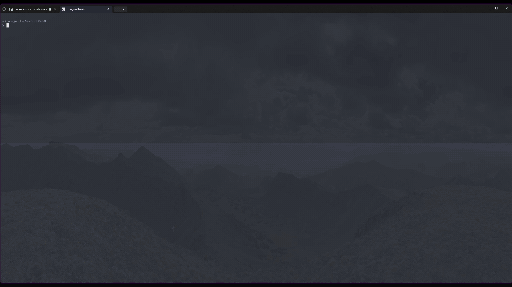

# dotfiles



## Overview

This repository contains my personal dotfiles for creating a consistent development environment across different machines and operating systems. It uses [Nix](https://nixos.org/) to manage packages, configurations, and dependencies declaratively.

## WSL (Debian)

```bash
nix build \
  --extra-experimental-features nix-command \
  --extra-experimental-features flakes \
  .#homeConfigurations.debianWsl.activationPackage && \
  ./result/activate
```

## macOS

```bash
nix build \
  --extra-experimental-features nix-command \
  --extra-experimental-features flakes \
  .#darwinConfigurations.bootstrap-arm.system && \
  sudo ./result/sw/bin/darwin-rebuild switch --flake .#macbook-arm
```
